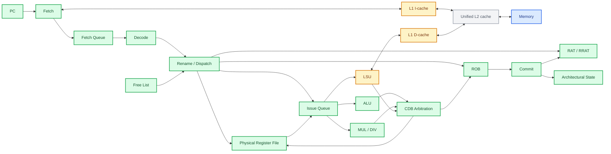

# RV32IM Research Core

[English](#english) | [中文](#中文)

## English

### Overview

RV32IM Research Core is a synthesizable RISC-V processor project developed in SystemVerilog. The
project uses an in-order implementation as a verified architectural baseline, then extends the
same ISA and commit interface toward pipelined and out-of-order microarchitectures.

All functional HDL implementation is completed by the author. AI assistance through OpenAI
Codex using GPT-5.6-sol is limited to Markdown documentation, Makefile maintenance, and
explanations, debugging suggestions, or development guidance when difficulties arise.

The project focuses on three goals:

- understanding the complete path from RISC-V instruction semantics to RTL;
- building a reusable verification environment based on architectural commit behavior;
- evaluating microarchitectural tradeoffs with simulation, synthesis, and timing data.

### Target Scope

The planned processor scope is:

- RV32IM integer instruction set;
- 32-bit integer registers and byte-addressed memory;
- little-endian bare-metal execution;
- synthesizable SystemVerilog;
- in-order reference core;
- five-stage in-order pipeline;
- separate L1 instruction and data caches;
- unified L2 cache;
- register renaming, physical register file, reorder buffer, and an issue queue;
- out-of-order execution with in-order retirement;
- commit-level differential verification;
- synthesis and timing evaluation with Yosys and OpenROAD.

The initial scope does not include virtual memory, Linux, multicore coherence, superscalar issue,
or the A/F/D/C/V extensions. Unsupported features are documented explicitly rather than being
treated as implemented behavior.

### Planned Architecture



Green nodes form the currently integrated OoO integer/control-flow, MUL/DIV, and shared-completion path. Amber nodes are implemented and tested elsewhere in the repository, but their OoO integration remains pending. Gray identifies planned structures, while blue identifies the external memory environment.

The design currently provides two complete RV32IM cores and one integrated partial OoO core:

1. `rv32_reference_core`: implemented multicycle in-order architectural reference;
2. `rv32_pipeline_core`: implemented five-stage in-order performance baseline;
3. `rv32_ooo_core`: integrated single-dispatch/single-issue OoO core with integer/control-flow and RV32M execution, dynamic scheduling, in-order retirement, branch recovery, and precise synchronous traps.

The OoO core executes RV32I ALU/control-flow and RV32M instructions. Independent ALU, buffered multiplier, and single-request divider producers share a round-robin CDB arbiter for PRF writeback, ROB completion, and dependent wakeup. Data-memory operations, L1 integration, and OoO/reference differential verification remain planned. All cores share the same external memory and architectural commit interface.

### Verification Strategy

Verification is developed together with the RTL:

- directed unit tests for decoder, ALU, architectural and physical register files, Fetch Queue, rename maps, physical-register allocation, branch, LSU, mul/div, ROB, and Issue Queue behavior;
- instruction-level assembly tests;
- randomized instruction and memory-response latency tests;
- a common architectural commit trace;
- implemented reference/pipeline commit differential checking; OoO/reference comparison remains planned;
- planned Spike comparison through an RVFI-like retirement interface;
- Verilator lint and Yosys synthesis sanity checks;
- implemented L1 cache regressions covering hit, miss, refill, replacement, masked stores, dirty writeback, backpressure, and access errors.

Correctness is established before IPC, frequency, or area optimizations are evaluated.

### Research Direction

The main planned study compares conservative memory scheduling with more aggressive load
scheduling in a small out-of-order core:

- loads and stores restricted to the ROB head;
- early loads when older memory operations are known not to conflict;
- a load/store queue with store-to-load forwarding.

The comparison will use retired-instruction count, cycle count, IPC, memory-stall cycles, cache
miss rates, synthesis area, and critical-path timing.

### Repository Layout

```text
rtl/                 synthesizable processor RTL
  pkg/               ISA constants, shared types, and interfaces
  frontend/          decode, immediate generation, and fetch logic
  core/              reference, pipeline, OoO, and system top levels
  pipeline/          pipeline registers, forwarding, and hazard control
  backend/           regfile, ALU, mul/div, rename, ROB, and scheduling
  cache/             implemented L1 caches; future L2 and adapters
  memory/            reserved for shared external-memory protocol RTL

tb/                  unit, core, and model testbenches
sw/                  reserved for bare-metal tests and benchmarks
docs/                indexed design, verification, and result documents
scripts/             reserved for project automation beyond the Makefile
.github/workflows/    reserved for continuous-integration jobs
```

### Project Status

The RV32IM multicycle reference core, five-stage in-order pipeline, and blocking direct-mapped L1 instruction and data caches are implemented and covered by self-checking regressions. Both L1 caches are integrated with the pipeline through a dedicated wrapper. The current `rv32_ooo_core` connects its frontend, decoder, rename/scheduling backend, ALU/control-flow and RV32M execution, shared CDB, in-order retirement, misprediction recovery, and precise synchronous traps. Data-memory/L1 integration, unified L2, and OoO differential verification remain planned. Implemented components include:

- shared RV32I control types and instruction opcodes;
- combinational integer ALU;
- combinational RV32I branch-condition unit;
- 32 × 32-bit architectural register file with two read ports and one write port;
- I-, S-, B-, U-, and J-type immediate generation;
- decoder support for all RV32I register-register and immediate ALU
  instructions, conditional branches, JAL, JALR, loads, and stores, plus LUI,
  AUIPC, and decode events for ECALL, EBREAK, FENCE, and FENCE.TSO; FENCE.I is
  not supported;
- a combinational load/store formatting unit with address-alignment checks, store byte enables, and signed or unsigned load extension;
- a three-stage RV32M multiplier using Radix-4 Booth recoding and a Wallace carry-save tree, with one-request-per-cycle throughput;
- a single-request RV32M divider using 32-cycle Radix-2 restoring division, signed-magnitude preprocessing, and RISC-V-defined corner-case handling;
- a multi-cycle in-order RV32IM reference core with blocking instruction/data interfaces, architectural commit reporting, system instructions, synchronous traps, and halt-after-trap behavior;
- a five-stage RV32IM pipeline with valid-bit stage control, optional RAW stalling, EX/MEM and MEM/WB forwarding, branch/JAL/JALR recovery, blocking load/store operation, and multicycle RV32M integration;
- a parameterized 32 KiB direct-mapped blocking L1 instruction cache with 32-byte lines, sequential word refill, request backpressure, atomic line installation, reset invalidation, and refill-error handling;
- a pipeline-plus-separate-L1 integration top with regressions covering instruction refill and redirect recovery, data load/store commits, masked store merging, dirty eviction, access faults, and backing-memory request counts;
- a parameterized 32 KiB direct-mapped blocking L1 data cache with masked store hits, write-allocate, dirty-victim writeback, sequential word transfers, request backpressure, atomic refill installation, and access-error recovery;
- an eight-entry Fetch Queue with ready/valid flow control, FIFO ordering, full-Queue simultaneous replacement, explicit pointer wraparound, instruction-fault metadata, and recovery Flush;
- a single-request out-of-order instruction frontend with I-cache backpressure, Fetch Queue flow control, sequential PC generation, redirect recovery, epoch-based stale-response rejection, and instruction-access-fault metadata;
- a 16-entry circular ROB with generation-tagged pointers, explicit occupancy, stored PC/instruction/destination payloads, tagged out-of-order result completion, stale-tag rejection, backpressured in-order retirement, and simultaneous allocation/retirement handling;
- a 64-entry physical register file with two combinational data-read ports, two independent rename-readiness lookup ports, allocation-based readiness tracking, one completion writeback port, hardwired p0 behavior, and allocation priority on same-register collisions;
- 32-entry speculative and committed rename maps with two source lookups, old-destination lookup, identity reset, fixed x0 mapping, and recovery that includes same-cycle retirement;
- a 64-entry physical-register free list with lowest-index allocation, speculative and committed availability maps, retirement-based old-mapping release, fixed p0 exclusion, exhaustion backpressure, and recovery that includes same-cycle retirement;
- an eight-entry, single-dispatch, single-issue queue with physical-tag wakeup, same-cycle Dispatch/CDB handling, functional-unit backpressure, deterministic lowest-slot selection, simultaneous Dispatch/Issue occupancy handling, and recovery Flush;
- an atomic single-instruction Rename/Dispatch controller that allocates ROB and Issue Queue entries together with optional Free List, RAT, and PRF destination updates;
- a combinational integer/control-flow Issue Stage with physical-register addressing, operand selection, branch comparison, actual-next-PC resolution, and completion backpressure;
- a one-entry registered Completion Buffer carrying result and actual-next-PC metadata with stable retention, recovery Flush, and bubble-free consume-and-replace throughput;
- a three-input round-robin CDB arbiter with single-winner downstream backpressure and fairness rotation;
- a buffered OoO multiplier producer that aligns ROB/physical-register metadata with the pipelined result, reserves four outstanding credits, absorbs CDB backpressure, and discards queued or in-flight work on recovery;
- a single-request OoO divider producer that retains instruction metadata, holds a completed result under CDB backpressure, and cancels active or buffered work on recovery;
- an integrated single-dispatch/single-issue OoO backend connecting Rename, Issue Queue, shared PRF reads, ALU/MUL/DIV producers, CDB writeback, ROB completion, RRAT/Free List updates, ordered retirement, branch recovery, and trap recovery;
- integrated OoO core regressions covering integer/control-flow execution, MUL/DIV dependencies, independent ALU completion during division, ALU/MUL arbitration and payload retention, active wrong-path DIV cancellation, precise ECALL retirement, and sticky halt;
- precise synchronous pipeline traps for illegal instructions, ECALL, EBREAK, instruction/data misalignment, and instruction/data access faults, followed by sticky halt;
- commit-level differential verification between the reference and pipeline cores using independent memory images and retirement-order comparison;
- directed unit, reference-core, pipeline, and OoO integration regressions covering the implemented paths, alongside reference/pipeline differential verification.

Core-level RV32M directed programs use MUL and DIV to check integration behavior. Decoder tests cover all eight RV32M operations; Rename/Dispatch routing tests directly check representative MUL and DIV operations. Standalone arithmetic tests cover signed/unsigned variants and corner cases. These checks are not a complete OoO ISA compliance or differential suite.

Run the current regression with:

```bash
make test
```

If the simulation tools require an environment setup script:

```bash
make CAD_ENV=/path/to/env.sh test
```

Run decoder simulation, lint, and synthesis sanity checks together with:

```bash
make CAD_ENV=/path/to/env.sh check-decoder
```

Run the same checks for the multiplier with:

```bash
make CAD_ENV=/path/to/env.sh check-multiplier
```

Run the same checks for the iterative divider with:

```bash
make CAD_ENV=/path/to/env.sh check-divider
```

Run all reference-core simulations, lint, and synthesis sanity checks with:

```bash
make CAD_ENV=/path/to/env.sh check-reference-core
```

Run all pipeline unit and core-level regressions with:

```bash
make CAD_ENV=/path/to/env.sh check-pipeline
```

Run the reference-versus-pipeline commit differential test with:

```bash
make CAD_ENV=/path/to/env.sh test-core-differential
```

Run the standalone I-cache regression and the pipeline L1-wrapper regression with:

```bash
make CAD_ENV=/path/to/env.sh test-icache
make CAD_ENV=/path/to/env.sh test-pipeline-l1
```

Run the standalone L1 D-cache regression with:

```bash
make CAD_ENV=/path/to/env.sh test-dcache
```

Run the out-of-order frontend, backend structure, and core-integration regressions with:

```bash
make CAD_ENV=/path/to/env.sh test-fetch-queue
make CAD_ENV=/path/to/env.sh test-ooo-frontend
make CAD_ENV=/path/to/env.sh test-rename-dispatch
make CAD_ENV=/path/to/env.sh test-ooo-execute
make CAD_ENV=/path/to/env.sh test-cdb-arbiter
make CAD_ENV=/path/to/env.sh test-ooo-multiplier
make CAD_ENV=/path/to/env.sh test-ooo-divider
make CAD_ENV=/path/to/env.sh test-ooo-integer
make CAD_ENV=/path/to/env.sh test-ooo-core
make CAD_ENV=/path/to/env.sh test-ooo-rv32m
make CAD_ENV=/path/to/env.sh test-phys-regfile
make CAD_ENV=/path/to/env.sh test-rename-map
make CAD_ENV=/path/to/env.sh test-free-list
make CAD_ENV=/path/to/env.sh test-issue-queue
make CAD_ENV=/path/to/env.sh test-rob test-rob-storage test-rob-completion test-rob-retirement
```

- The [documentation index](docs/README.md) groups public design notes, verification references, and reproducible results.

### License

This project is licensed under the [Apache License 2.0](LICENSE).

---

## 中文

### 项目简介

RV32IM Research Core 是一个使用 SystemVerilog 开发的可综合 RISC-V 处理器项目。
项目先建立经过验证的顺序执行实现，作为 architectural baseline，再在相同 ISA
和 commit interface 上逐步发展出流水线和乱序执行微架构。

所有具有功能意义的 HDL 实现均由作者完成。AI 辅助使用 OpenAI Codex（GPT-5.6-sol），仅用于 Markdown 文档和 Makefile 的整理维护，并在开发遇到困难时提供原理讲解、调试建议和方向性指导。

项目主要关注三个目标：

- 理解从 RISC-V 指令语义到 RTL 数据通路的完整过程；
- 建立基于 architectural commit behavior 的可复用验证环境；
- 使用仿真、综合和时序数据研究微架构设计取舍。

### 目标范围

计划中的处理器范围包括：

- RV32IM 整数指令集；
- 32 位整数寄存器和 byte-addressed memory；
- little-endian bare-metal 执行环境；
- 可综合 SystemVerilog；
- 顺序参考核；
- 五级顺序流水线；
- 分离的 L1 instruction/data cache；
- unified L2 cache；
- register renaming、physical register file、ROB 和 Issue Queue；
- 乱序执行、顺序退休；
- commit-level differential verification；
- 使用 Yosys/OpenROAD 进行综合和时序实验。

第一阶段不包含虚拟内存、Linux、多核一致性、超标量发射以及 A/F/D/C/V 扩展。
所有未实现功能都会在文档中明确标注，不会被当作已经支持的行为。

### 计划架构


绿色节点组成当前已经接通的 OoO 整数、控制流、乘除法和统一完成广播路径。黄色节点已经在仓库其他部分实现并通过测试，但尚未接入 OoO core；灰色节点仍处于规划阶段；蓝色节点表示外部 memory 环境。

项目目前包含两个完整 RV32IM core 和一个已经接通的部分 OoO core：

1. `rv32_reference_core`：已实现的多周期顺序 architectural reference；
2. `rv32_pipeline_core`：已实现的五级顺序流水线性能 baseline；
3. `rv32_ooo_core`：已接通的单 Dispatch、单 Issue OoO core，支持整数/控制流与 RV32M 执行、动态调度、顺序退休、分支恢复和精确同步异常。

当前 OoO core 可以执行 RV32I ALU、控制流和 RV32M 指令。ALU、带缓冲的乘法 producer 和单请求除法 producer 通过 round-robin CDB arbiter 共用 PRF 写回、ROB completion 和依赖唤醒路径。数据访存、L1 接入以及 OoO/reference 差分验证仍待实现。所有 core 共用相同的外部 memory interface 和 architectural commit interface。

### 验证方法

验证环境和 RTL 同步开发：

- decoder、ALU、架构/物理寄存器文件、Fetch Queue、重命名映射表、物理寄存器分配、branch、LSU、mul/div、ROB 和 Issue Queue 单元测试；
- 指令级汇编测试；
- 随机指令和随机 memory response latency；
- 统一 architectural commit trace；
- 已实现 reference/pipeline 逐条 Commit 差分比较；OoO/reference 比较仍待接入；
- 计划通过 RVFI-like retirement interface 与 Spike 比较；
- Verilator lint 和 Yosys synthesis sanity check；
- 已实现的 L1 cache regression，覆盖 hit、miss、refill、replacement、masked store、dirty writeback、backpressure 和 access error。

项目会先证明正确性，再评估 IPC、频率和面积优化。

### 研究方向

计划研究小型乱序核中，保守 memory scheduling 和更激进 load scheduling 的差异：

- load/store 都限制在 ROB head；
- 确认与旧 memory operation 无冲突后允许 load 提前执行；
- 使用 load/store queue 和 store-to-load forwarding。

实验将比较退休指令数、周期数、IPC、memory stall cycles、cache miss rate、综合面积
和关键路径时序。

### 仓库结构

```text
rtl/                 可综合处理器 RTL
  pkg/               ISA 常量、公共类型和接口
  frontend/          decode、immediate generation 和 fetch
  core/              reference、pipeline、OoO 和 system top
  pipeline/          流水线寄存器、forwarding 和 hazard control
  backend/           regfile、ALU、mul/div、rename、ROB 和调度
  cache/             已实现的 L1；未来的 L2 和 adapter
  memory/            为共享外部 memory protocol RTL 预留

tb/                  unit、core 和 model testbench
sw/                  为 bare-metal 测试与 benchmark 预留
docs/                带索引的设计、验证和实验结果文档
scripts/             为 Makefile 之外的自动化脚本预留
.github/workflows/    为持续集成任务预留
```

### 当前状态

RV32IM 多周期 reference core、五级顺序流水线以及 blocking direct-mapped L1 instruction/data cache 已经实现，并具有 self-checking regression。两个 L1 cache 已经通过独立 wrapper 接入 pipeline。当前 `rv32_ooo_core` 已接通 frontend、decoder、重命名/调度后端、ALU/控制流与 RV32M 执行、共享 CDB、顺序退休、错误预测恢复和精确同步异常。数据访存/L1 接入、Unified L2 和 OoO 差分验证仍待实现。当前已实现内容包括：

- 公共 RV32I 控制类型与指令 opcode；
- 组合逻辑整数 ALU；
- RV32I 组合逻辑 branch-condition 单元；
- 具有两个读端口和一个写端口的 32 × 32-bit 架构寄存器堆；
- I、S、B、U 和 J-type immediate 生成；
- decoder 已支持全部 RV32I 寄存器和 immediate ALU 指令、conditional
  branch、JAL、JALR、load 和 store，以及 LUI、AUIPC；同时能够识别 ECALL、
  EBREAK、FENCE 和 FENCE.TSO 事件；暂不支持 FENCE.I；
- 组合逻辑 LSU formatting 单元，支持地址对齐检查、store byte enable 和 signed/unsigned load extension；
- 三级 RV32M 乘法器，使用 Radix-4 Booth 编码和 Wallace carry-save tree，吞吐率为每周期一条请求；
- 单请求 RV32M 除法器，使用 32 周期 Radix-2 restoring division，支持 signed-magnitude 预处理和 RISC-V 规定的除零、溢出行为；
- 多周期顺序 RV32IM reference core，具有 blocking instruction/data interface、architectural commit、system instruction、同步 trap 和 trap 后 HALT；
- 五级 RV32IM 顺序流水线，具有 valid-bit stage control、可选 RAW stall、EX/MEM 与 MEM/WB forwarding、branch/JAL/JALR recovery、blocking load/store 和多周期 RV32M 集成；
- 参数化的32 KiB direct-mapped blocking L1 instruction cache，使用32-byte line，支持逐 word refill、request backpressure、整 line 原子安装、reset invalidation 和 refill error 处理；
- pipeline + separate L1 集成顶层及自检 regression，覆盖 instruction refill 与 redirect recovery、data load/store commit、masked store merge、dirty eviction、access fault 和 backing-memory request count；
- 参数化的32 KiB direct-mapped blocking L1 data cache，支持 masked store hit、write-allocate、dirty victim writeback、逐 word transfer、request backpressure、整 line 原子安装和 access error 恢复；
- 8-entry Fetch Queue，支持 ready/valid flow control、FIFO 顺序、满队列同周期替换、显式指针回绕、取指错误信息和 recovery Flush；
- 单请求 OoO 取指前端，支持 I-cache backpressure、Fetch Queue flow control、顺序 PC 生成、redirect recovery、基于 epoch 的旧响应丢弃和 instruction access fault 信息传递；
- 16-entry circular ROB，使用带 generation 的指针、显式 occupancy 和 PC/instruction/destination payload storage，支持 tagged out-of-order result completion、stale-tag rejection、带 backpressure 的顺序 retirement 以及同周期 allocation/retirement；
- 64-entry 物理寄存器文件，具有两个组合数据读端口、两个独立 Rename ready 查询端口、allocation ready-state tracking、单 completion writeback 端口、固定 p0 行为以及同地址冲突时的 allocation 优先级；
- 各 32 项的推测/已提交重命名映射表，支持双源查询、旧目标映射查询、初始一一映射、固定 x0 映射，以及包含同周期 retirement 的恢复；
- 64-entry 物理寄存器 Free List，支持最低编号优先分配、推测/已提交空闲状态、retirement 释放旧映射、固定排除 p0、耗尽 backpressure，以及包含同周期 retirement 的恢复；
- 8-entry 单 Dispatch、单 Issue 调度队列，支持物理 tag 唤醒、同周期 Dispatch/CDB 处理、功能单元 backpressure、确定性的最低槽位选择、同周期 Dispatch/Issue occupancy 更新和 recovery Flush；
- 原子单指令 Rename/Dispatch 控制器，将 ROB 和 Issue Queue 分配与可选的 Free List、RAT 和 PRF 目标更新绑定为同一事务；
- 组合逻辑整数/控制流 Issue Stage，支持物理寄存器寻址、操作数选择、branch compare、实际 next-PC 解析和 completion backpressure；
- 单项寄存式 Completion Buffer，携带结果和 actual-next-PC metadata，支持稳定保持、recovery Flush 和无气泡 consume-and-replace；
- 三输入 round-robin CDB arbiter，支持单 winner 下游 backpressure 和公平轮换；
- 带缓冲的 OoO 乘法 producer，能够将 ROB/物理寄存器 metadata 与流水结果对齐，预留四个 outstanding credit，吸收 CDB backpressure，并在 recovery 时丢弃队列内和流水线内的旧工作；
- 单请求 OoO 除法 producer，保存指令 metadata，在 CDB backpressure 下保持完成结果，并在 recovery 时清除在途计算或已保存结果；
- 集成的单 Dispatch、单 Issue OoO backend，连接 Rename、Issue Queue、共享 PRF 读端口、ALU/MUL/DIV producer、CDB 写回、ROB 完成、RRAT/Free List 更新、顺序退休、分支恢复和异常恢复；
- OoO core 自检 regression，覆盖整数/控制流执行、MUL/DIV 依赖、除法期间独立 ALU 先完成、ALU/MUL 仲裁与 payload 保持、错误路径在途 DIV 取消、精确 ECALL 退休和 sticky halt；
- 精确同步异常，覆盖非法指令、ECALL、EBREAK、指令/数据地址未对齐和 instruction/data access fault，异常提交后进入 sticky HALT；
- Reference core 与 pipeline core 之间的 commit-level 差分验证，使用独立 memory image 并按退休顺序比较；
- 覆盖已接通路径的 unit、reference-core、pipeline 和 OoO integration directed regression，以及 reference/pipeline 差分验证。

Core-level RV32M 定向程序使用 MUL 和 DIV 检查集成行为；decoder 测试覆盖八条 RV32M 指令，Rename/Dispatch 路由测试直接检查 MUL、DIV 两个代表，独立算术测试覆盖有符号/无符号变体及边界情况。这不等于完整的 OoO ISA 合规或差分验证。

运行当前全部测试：

```bash
make test
```

如果仿真工具需要环境初始化脚本：

```bash
make CAD_ENV=/path/to/env.sh test
```

同时运行 decoder 仿真、lint 和综合完整性检查：

```bash
make CAD_ENV=/path/to/env.sh check-decoder
```

同时运行乘法器仿真、lint 和综合完整性检查：

```bash
make CAD_ENV=/path/to/env.sh check-multiplier
```

同时运行迭代除法器仿真、lint 和综合完整性检查：

```bash
make CAD_ENV=/path/to/env.sh check-divider
```

运行全部 reference-core 仿真、lint 和综合完整性检查：

```bash
make CAD_ENV=/path/to/env.sh check-reference-core
```

运行全部 pipeline unit 和 core-level regression：

```bash
make CAD_ENV=/path/to/env.sh check-pipeline
```

运行 reference core 与 pipeline core 的 commit 差分测试：

```bash
make CAD_ENV=/path/to/env.sh test-core-differential
```

运行独立 I-cache 和 pipeline L1 wrapper 集成测试：

```bash
make CAD_ENV=/path/to/env.sh test-icache
make CAD_ENV=/path/to/env.sh test-pipeline-l1
```

运行独立 L1 D-cache regression：

```bash
make CAD_ENV=/path/to/env.sh test-dcache
```

运行 OoO 前端、后端数据结构和 core 集成 regression：

```bash
make CAD_ENV=/path/to/env.sh test-fetch-queue
make CAD_ENV=/path/to/env.sh test-ooo-frontend
make CAD_ENV=/path/to/env.sh test-rename-dispatch
make CAD_ENV=/path/to/env.sh test-ooo-execute
make CAD_ENV=/path/to/env.sh test-cdb-arbiter
make CAD_ENV=/path/to/env.sh test-ooo-multiplier
make CAD_ENV=/path/to/env.sh test-ooo-divider
make CAD_ENV=/path/to/env.sh test-ooo-integer
make CAD_ENV=/path/to/env.sh test-ooo-core
make CAD_ENV=/path/to/env.sh test-ooo-rv32m
make CAD_ENV=/path/to/env.sh test-phys-regfile
make CAD_ENV=/path/to/env.sh test-rename-map
make CAD_ENV=/path/to/env.sh test-free-list
make CAD_ENV=/path/to/env.sh test-issue-queue
make CAD_ENV=/path/to/env.sh test-rob test-rob-storage test-rob-completion test-rob-retirement
```

- [文档索引](docs/README.md)按照公开设计说明、验证资料和可复现实验结果组织项目文档。

### 开源许可证

本项目采用 [Apache License 2.0](LICENSE) 开源许可证。
