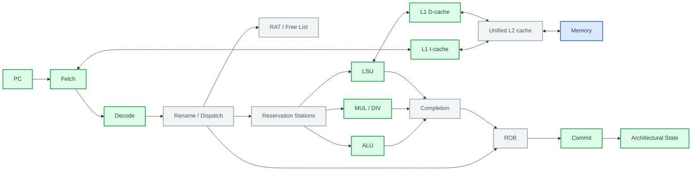

# RV32IM Research Core

[English](#english) | [中文](#中文)

## English

### Overview

RV32IM Research Core is a synthesizable RISC-V processor project developed in SystemVerilog. The
project uses an in-order implementation as a verified architectural baseline, then extends the
same ISA and commit interface toward pipelined and out-of-order microarchitectures.

The architecture, implementation, and verification are developed by the author with assistance
from OpenAI Codex (GPT-5.6-sol).

The project focuses on three goals:

- understanding the complete path from RISC-V instruction semantics to RTL;
- building a reusable verification environment based on architectural commit behavior;
- evaluating microarchitectural tradeoffs with simulation, synthesis, and timing data.

### Target Scope

The planned processor scope is:

- RV32IM integer instruction set;
- 32-bit integer registers and byte-addressed memory;
- little-endian bare-metal execution;
- synthesizable SystemVerilog;
- in-order reference core;
- five-stage in-order pipeline;
- separate L1 instruction and data caches;
- unified L2 cache;
- register renaming, physical register file, reorder buffer, and reservation stations;
- out-of-order execution with in-order retirement;
- commit-level differential verification;
- synthesis and timing evaluation with Yosys and OpenROAD.

The initial scope does not include virtual memory, Linux, multicore coherence, superscalar issue,
or the A/F/D/C/V extensions. Unsupported features are documented explicitly rather than being
treated as implemented behavior.

### Planned Architecture



Green nodes identify implemented capabilities, including the pipeline-integrated L1 I-cache and standalone L1 D-cache. Gray nodes are planned cache or OoO structures, while blue identifies the external memory environment. Green does not imply that a block has already been integrated into every core.

The design is organized around three independently testable cores:

1. `rv32_reference_core`: implemented multicycle in-order architectural reference;
2. `rv32_pipeline_core`: implemented five-stage in-order performance baseline;
3. `rv32_ooo_core`: planned dynamically scheduled core with in-order retirement.

All cores are intended to share the same memory and architectural commit interfaces.

### Verification Strategy

Verification is developed together with the RTL:

- directed unit tests for decoder, ALU, regfile, branch, LSU, and mul/div units;
- instruction-level assembly tests;
- randomized instruction and memory-response latency tests;
- a common architectural commit trace;
- differential checking between the reference, pipeline, and OoO cores;
- Spike comparison through an RVFI-like retirement interface;
- Verilator lint and Yosys synthesis sanity checks;
- implemented L1 cache regressions covering hit, miss, refill, replacement, masked stores, dirty writeback, backpressure, and access errors.

Correctness is established before IPC, frequency, or area optimizations are evaluated.

### Research Direction

The main planned study compares conservative memory scheduling with more aggressive load
scheduling in a small out-of-order core:

- loads and stores restricted to the ROB head;
- early loads when older memory operations are known not to conflict;
- a load/store queue with store-to-load forwarding.

The comparison will use retired-instruction count, cycle count, IPC, memory-stall cycles, cache
miss rates, synthesis area, and critical-path timing.

### Repository Layout

```text
rtl/                 synthesizable processor RTL
  pkg/               ISA constants, shared types, and interfaces
  frontend/          decode, immediate generation, and fetch logic
  core/              reference, pipeline, OoO, and system top levels
  pipeline/          pipeline registers, forwarding, and hazard control
  backend/           regfile, ALU, mul/div, rename, ROB, and scheduling
  cache/             L1 caches, L2 cache, and cache-line adapters
  memory/            external memory protocol definitions

tb/                  unit, core, and model testbenches
sw/                  bare-metal tests and benchmarks
docs/                design, verification, development, and result documents
scripts/             build, regression, synthesis, and result-processing scripts
.github/workflows/    continuous-integration jobs
```

### Project Status

The RV32IM multicycle reference core, five-stage in-order pipeline, and blocking direct-mapped L1 instruction and data caches are implemented and covered by self-checking regressions. Pipeline integration of the L1 data cache, the unified L2 cache, external-model differential verification, and the out-of-order core remain planned. Implemented components include:

- shared RV32I control types and instruction opcodes;
- combinational integer ALU;
- combinational RV32I branch-condition unit;
- 32 × 32-bit architectural register file with two read ports and one write port;
- I-, S-, B-, U-, and J-type immediate generation;
- decoder support for all RV32I register-register and immediate ALU
  instructions, conditional branches, JAL, JALR, loads, and stores, plus LUI,
  AUIPC, and decode events for ECALL, EBREAK, FENCE, and FENCE.TSO; FENCE.I is
  not supported;
- a combinational load/store formatting unit with address-alignment checks, store byte enables, and signed or unsigned load extension;
- a three-stage RV32M multiplier using Radix-4 Booth recoding and a Wallace carry-save tree, with one-request-per-cycle throughput;
- a single-request RV32M divider using 32-cycle Radix-2 restoring division, signed-magnitude preprocessing, and RISC-V-defined corner-case handling;
- a multi-cycle in-order RV32IM reference core with blocking instruction/data interfaces, architectural commit reporting, system instructions, synchronous traps, and halt-after-trap behavior;
- a five-stage RV32IM pipeline with valid-bit stage control, optional RAW stalling, EX/MEM and MEM/WB forwarding, branch/JAL/JALR recovery, blocking load/store operation, and multicycle RV32M integration;
- a parameterized 32 KiB direct-mapped blocking L1 instruction cache with 32-byte lines, sequential word refill, request backpressure, atomic line installation, reset invalidation, and refill-error handling;
- a pipeline-plus-I-cache integration top with regressions covering same-line hits, cross-line refill, JAL redirect recovery, conflict replacement, failed refill behavior, and backing-memory request counts;
- a parameterized 32 KiB direct-mapped blocking L1 data cache with masked store hits, write-allocate, dirty-victim writeback, sequential word transfers, request backpressure, atomic refill installation, and access-error recovery;
- precise synchronous pipeline traps for illegal instructions, ECALL, EBREAK, instruction/data misalignment, and instruction/data access faults, followed by sticky halt;
- commit-level differential verification between the reference and pipeline cores using independent memory images and retirement-order comparison;
- directed unit, reference-core, and pipeline regressions covering stage movement, stalls, forwarding, control flow, memory operations, RV32M, traps, and reset behavior.

Run the current regression with:

```bash
make test
```

If the simulation tools require an environment setup script:

```bash
make CAD_ENV=/path/to/env.sh test
```

Run decoder simulation, lint, and synthesis sanity checks together with:

```bash
make CAD_ENV=/path/to/env.sh check-decoder
```

Run the same checks for the multiplier with:

```bash
make CAD_ENV=/path/to/env.sh check-multiplier
```

Run the same checks for the iterative divider with:

```bash
make CAD_ENV=/path/to/env.sh check-divider
```

Run all reference-core simulations, lint, and synthesis sanity checks with:

```bash
make CAD_ENV=/path/to/env.sh check-reference-core
```

Run all pipeline unit and core-level regressions with:

```bash
make CAD_ENV=/path/to/env.sh check-pipeline
```

Run the reference-versus-pipeline commit differential test with:

```bash
make CAD_ENV=/path/to/env.sh test-core-differential
```

Run the standalone and pipeline-integrated L1 I-cache regressions with:

```bash
make CAD_ENV=/path/to/env.sh test-icache
make CAD_ENV=/path/to/env.sh test-pipeline-icache
```

Run the standalone L1 D-cache regression with:

```bash
make CAD_ENV=/path/to/env.sh test-dcache
```

- The [RV32IM RTL development guide](docs/rv32im-decode-table.md) explains instruction semantics, encodings, datapath responsibilities, module implementation steps, and required unit tests.
- The [reference-core development guide](docs/rv32-reference-core.md) explains the multi-cycle datapath, state machine, memory protocol, commit semantics, and integration sequence.
- The [reference-core verification guide](docs/rv32-reference-core-verification.md) documents the current testbench structure, trap matrix, invariants, and regression commands.
- The [five-stage pipeline guide](docs/rv32-pipeline-core.md) explains stage payloads, hazards, forwarding, blocking operations, precise traps, and pipeline regressions.
- The [core differential verification guide](docs/rv32-core-differential-verification.md) explains reference-model confidence, commit-event comparison, independent memories, scoreboard design, and extension strategy.
- The [L1 cache development guide](docs/rv32-cache-development.md) explains cache geometry, address decomposition, hit lookup, blocking refill, error handling, and the path from direct-mapped I-cache to a complete L1 hierarchy.
- The [L1 D-cache development guide](docs/rv32-dcache-development.md) explains masked store hits, write-allocate, dirty-victim writeback, error ordering, and pipeline integration.
- The [Radix-4 Booth multiplier guide](docs/radix4-booth-multiplier.md) explains Booth recoding, partial products, the Wallace carry-save tree, and pipeline placement.
- The [Radix-2 iterative divider guide](docs/radix2-iterative-divider.md) derives the restoring algorithm, signed conversion, architectural corner cases, and cycle-by-cycle implementation.

### License

This project is licensed under the [Apache License 2.0](LICENSE).

---

## 中文

### 项目简介

RV32IM Research Core 是一个使用 SystemVerilog 开发的可综合 RISC-V 处理器项目。
项目先建立经过验证的顺序执行实现，作为 architectural baseline，再在相同 ISA
和 commit interface 上逐步发展出流水线和乱序执行微架构。

项目的架构、实现和验证由作者完成，并使用 OpenAI Codex（GPT-5.6-sol）辅助开发。

项目主要关注三个目标：

- 理解从 RISC-V 指令语义到 RTL 数据通路的完整过程；
- 建立基于 architectural commit behavior 的可复用验证环境；
- 使用仿真、综合和时序数据研究微架构设计取舍。

### 目标范围

计划中的处理器范围包括：

- RV32IM 整数指令集；
- 32 位整数寄存器和 byte-addressed memory；
- little-endian bare-metal 执行环境；
- 可综合 SystemVerilog；
- 顺序参考核；
- 五级顺序流水线；
- 分离的 L1 instruction/data cache；
- unified L2 cache；
- register renaming、physical register file、ROB 和 reservation stations；
- 乱序执行、顺序退休；
- commit-level differential verification；
- 使用 Yosys/OpenROAD 进行综合和时序实验。

第一阶段不包含虚拟内存、Linux、多核一致性、超标量发射以及 A/F/D/C/V 扩展。
所有未实现功能都会在文档中明确标注，不会被当作已经支持的行为。

### 计划架构


绿色节点表示已经实现的能力，包括与 pipeline 集成的 L1 I-cache 和独立验证的 L1 D-cache；灰色节点表示计划中的 cache 或 OoO 结构；蓝色节点表示外部 memory 环境。绿色不代表该模块已经集成进每一种 core。

项目按三种可以独立测试的处理器实现组织：

1. `rv32_reference_core`：已实现的多周期顺序 architectural reference；
2. `rv32_pipeline_core`：已实现的五级顺序流水线性能 baseline；
3. `rv32_ooo_core`：计划实现的动态调度、顺序退休乱序核。

三种实现计划共用相同的 memory interface 和 architectural commit interface。

### 验证方法

验证环境和 RTL 同步开发：

- decoder、ALU、regfile、branch、LSU 和 mul/div 单元测试；
- 指令级汇编测试；
- 随机指令和随机 memory response latency；
- 统一 architectural commit trace；
- reference、pipeline 和 OoO core 之间的逐条差分比较；
- 通过 RVFI-like retirement interface 与 Spike 比较；
- Verilator lint 和 Yosys synthesis sanity check；
- 已实现的 L1 cache regression，覆盖 hit、miss、refill、replacement、masked store、dirty writeback、backpressure 和 access error。

项目会先证明正确性，再评估 IPC、频率和面积优化。

### 研究方向

计划研究小型乱序核中，保守 memory scheduling 和更激进 load scheduling 的差异：

- load/store 都限制在 ROB head；
- 确认与旧 memory operation 无冲突后允许 load 提前执行；
- 使用 load/store queue 和 store-to-load forwarding。

实验将比较退休指令数、周期数、IPC、memory stall cycles、cache miss rate、综合面积
和关键路径时序。

### 仓库结构

```text
rtl/                 可综合处理器 RTL
  pkg/               ISA 常量、公共类型和接口
  frontend/          decode、immediate generation 和 fetch
  core/              reference、pipeline、OoO 和 system top
  pipeline/          流水线寄存器、forwarding 和 hazard control
  backend/           regfile、ALU、mul/div、rename、ROB 和调度
  cache/             L1、L2 和 cache-line adapter
  memory/            外部 memory protocol 定义

tb/                  unit、core 和 model testbench
sw/                  bare-metal 测试与 benchmark
docs/                设计、验证、开发记录和实验结果
scripts/             构建、回归、综合和结果处理脚本
.github/workflows/    自动测试
```

### 当前状态

RV32IM 多周期 reference core、五级顺序流水线以及 blocking direct-mapped L1 instruction/data cache 已经实现，并具有 self-checking regression。L1 data cache 的 pipeline 集成、unified L2 cache、外部模型差分验证和乱序核仍属于后续计划。当前已实现内容包括：

- 公共 RV32I 控制类型与指令 opcode；
- 组合逻辑整数 ALU；
- RV32I 组合逻辑 branch-condition 单元；
- 具有两个读端口和一个写端口的 32 × 32-bit 架构寄存器堆；
- I、S、B、U 和 J-type immediate 生成；
- decoder 已支持全部 RV32I 寄存器和 immediate ALU 指令、conditional
  branch、JAL、JALR、load 和 store，以及 LUI、AUIPC；同时能够识别 ECALL、
  EBREAK、FENCE 和 FENCE.TSO 事件；暂不支持 FENCE.I；
- 组合逻辑 LSU formatting 单元，支持地址对齐检查、store byte enable 和 signed/unsigned load extension；
- 三级 RV32M 乘法器，使用 Radix-4 Booth 编码和 Wallace carry-save tree，吞吐率为每周期一条请求；
- 单请求 RV32M 除法器，使用 32 周期 Radix-2 restoring division，支持 signed-magnitude 预处理和 RISC-V 规定的除零、溢出行为；
- 多周期顺序 RV32IM reference core，具有 blocking instruction/data interface、architectural commit、system instruction、同步 trap 和 trap 后 HALT；
- 五级 RV32IM 顺序流水线，具有 valid-bit stage control、可选 RAW stall、EX/MEM 与 MEM/WB forwarding、branch/JAL/JALR recovery、blocking load/store 和多周期 RV32M 集成；
- 参数化的32 KiB direct-mapped blocking L1 instruction cache，使用32-byte line，支持逐 word refill、request backpressure、整 line 原子安装、reset invalidation 和 refill error 处理；
- pipeline + I-cache 集成顶层及自检 regression，覆盖 same-line hit、cross-line refill、JAL redirect recovery、conflict replacement、refill failure 和 backing-memory request count；
- 参数化的32 KiB direct-mapped blocking L1 data cache，支持 masked store hit、write-allocate、dirty victim writeback、逐 word transfer、request backpressure、整 line 原子安装和 access error 恢复；
- 精确同步异常，覆盖非法指令、ECALL、EBREAK、指令/数据地址未对齐和 instruction/data access fault，异常提交后进入 sticky HALT；
- Reference core 与 pipeline core 之间的 commit-level 差分验证，使用独立 memory image 并按退休顺序比较；
- 覆盖 stage movement、stall、forwarding、control flow、memory、RV32M、trap 和 reset behavior 的 unit、reference-core 与 pipeline directed regression。

运行当前全部测试：

```bash
make test
```

如果仿真工具需要环境初始化脚本：

```bash
make CAD_ENV=/path/to/env.sh test
```

同时运行 decoder 仿真、lint 和综合完整性检查：

```bash
make CAD_ENV=/path/to/env.sh check-decoder
```

同时运行乘法器仿真、lint 和综合完整性检查：

```bash
make CAD_ENV=/path/to/env.sh check-multiplier
```

同时运行迭代除法器仿真、lint 和综合完整性检查：

```bash
make CAD_ENV=/path/to/env.sh check-divider
```

运行全部 reference-core 仿真、lint 和综合完整性检查：

```bash
make CAD_ENV=/path/to/env.sh check-reference-core
```

运行全部 pipeline unit 和 core-level regression：

```bash
make CAD_ENV=/path/to/env.sh check-pipeline
```

运行 reference core 与 pipeline core 的 commit 差分测试：

```bash
make CAD_ENV=/path/to/env.sh test-core-differential
```

运行独立 I-cache 和 pipeline + I-cache 集成测试：

```bash
make CAD_ENV=/path/to/env.sh test-icache
make CAD_ENV=/path/to/env.sh test-pipeline-icache
```

运行独立 L1 D-cache regression：

```bash
make CAD_ENV=/path/to/env.sh test-dcache
```

- [RV32IM RTL 开发教程](docs/rv32im-decode-table.md)说明了指令语义、编码、数据通路职责、逐模块实现步骤和必须完成的单元测试。
- [Reference core 开发教程](docs/rv32-reference-core.md)说明了多周期数据通路、状态机、memory protocol、commit 语义和集成顺序。
- [Reference core 验证指南](docs/rv32-reference-core-verification.md)说明了当前 testbench 结构、trap 测试矩阵、永久检查和回归命令。
- [五级流水线指南](docs/rv32-pipeline-core.md)说明了 stage payload、hazard、forwarding、blocking operation、精确异常和 pipeline regression。
- [Core 差分验证教程](docs/rv32-core-differential-verification.md)说明了 reference model 的可信度、commit event 比较、独立 memory、scoreboard 设计和扩展方法。
- [L1 Cache 开发教程](docs/rv32-cache-development.md)说明了 cache geometry、地址分解、hit lookup、blocking refill、错误处理以及从 direct-mapped I-cache 到完整 L1 hierarchy 的开发路径。
- [L1 D-cache 开发教程](docs/rv32-dcache-development.md)说明了 masked store hit、write-allocate、dirty victim writeback、错误顺序和 pipeline 集成。
- [Radix-4 Booth 乘法器教程](docs/radix4-booth-multiplier.md)说明了 Booth recoding、partial product、Wallace carry-save tree 和流水级划分。
- [Radix-2 迭代除法器教程](docs/radix2-iterative-divider.md)说明了 restoring algorithm、signed 转换、架构特殊情况和逐周期实现方法。

### 开源许可证

本项目采用 [Apache License 2.0](LICENSE) 开源许可证。
