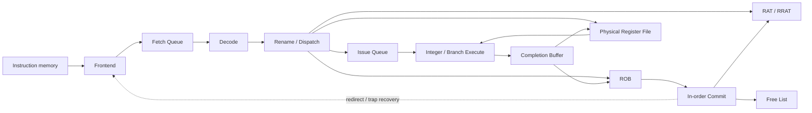

# RV32 OoO Core Design

本文说明当前 `rv32_ooo_core` 的实现边界、主要数据流、恢复规则和验证范围。当前版本是
single-dispatch、single-issue 的整数乱序核心：指令可以按照 operand readiness 乱序完成，
但必须按照 ROB 中的程序顺序退休。

## 1. 当前范围

已经接通的 core 路径包括：

- 单请求 instruction frontend、8-entry Fetch Queue 和静态 not-taken 预测；
- RV32I Decode 和 immediate generation；
- RAT/RRAT、64-entry PRF、Free List 和 16-entry ROB；
- 8-entry Issue Queue、整数 ALU 和 branch condition evaluation；
- completion buffer、PRF writeback、ROB completion 和顺序 Commit；
- Branch/JAL/JALR actual-next-PC 解析及退休时错误预测恢复；
- instruction access fault、illegal instruction、ECALL 和 EBREAK 的精确异常 metadata；
- trap 退休后的 sticky halt。

以下能力尚未接入 OoO core：

- RV32M multiplier/divider 和多 completion producer 的 core-level 写回路径；
- load/store、data-memory interface、L1 data cache 和 memory ordering；
- OoO core 与 reference core 的 commit-level differential regression；
- superscalar Dispatch/Issue、advanced branch prediction、LSQ 和 L2 cache。

RV32M Dispatch 分类、round-robin CDB arbiter 和带四项 completion queue 的 OoO multiplier
wrapper 已完成独立验证。仓库中的 divider、LSU 和 L1 cache 也已用于其他 core 或独立测试；
这些支撑模块的存在不代表相应路径已经接入 `rv32_ooo_core`。

## 2. 数据流



Frontend 每次只保留一个 outstanding request，并把 `pc`、`instr`、
`predicted_next_pc` 和 instruction-access-fault 信息一起放入 Fetch Queue。当前预测器始终
选择 `PC+4`。

Rename/Dispatch 必须原子取得所需资源。ROB、Issue Queue 和 destination physical register
中的任何必要资源不可用时，该指令不能只更新其中一部分结构。

Issue Queue 根据 physical source readiness 和 functional-unit readiness 选择 entry。当前使用
最低槽位优先；它是确定性选择，不是严格 oldest-first age policy。

## 3. Rename 与物理寄存器

RAT 保存 speculative architectural-to-physical mapping，RRAT 保存已退休 mapping。写入非零
architectural register 的指令从 Free List 分配新 physical register，并把旧 mapping 保存到
ROB：

```text
Rename x5: old P5 -> new P32
ROB stores: rd=x5, new=P32, old=P5
Commit: RRAT[x5]=P32, release P5
```

PRF allocation 会清除目标 physical register 的 ready bit。Completion 根据 physical tag
写入 value 并置 ready；Issue Queue 同时通过 CDB tag 唤醒等待该结果的 consumer。

恢复时 RAT 和 Free List 从 committed checkpoint 恢复。产生恢复的指令本身仍在同一周期
完成 Commit，因此两个结构都显式包含该周期的退休更新。

## 4. ROB、Completion 与 Commit

ROB 按程序顺序分配，execution 按 generation-tagged ROB tag 完成。Generation bit 防止 slot
复用后接收旧 completion。只有 completed Head entry 能通过 ready/valid Commit interface
退休。

ROB entry 保存：

- PC、instruction 和 architectural/physical destination metadata；
- predicted next PC 和 control-flow kind；
- trap 标志及 trap cause；
- execution result 和 actual next PC；
- valid、completed 和 generation 状态。

当前 ALU/branch execution path 后有一个 one-entry completion buffer。它在写回端暂时不能
接受结果时稳定保存 payload，并允许 consume-and-replace。独立的 round-robin CDB arbiter
已经能够在 ALU、MUL 和 DIV 三个 producer 之间每周期选择一个 completion；OoO multiplier
wrapper 使用四项 credit 和 completion queue 对齐 metadata、吸收 CDB backpressure，并在
recovery 时清除在途结果。这两个模块尚未连接到当前 backend/core。

## 5. Control-flow Recovery

Branch 使用 PRF 中的两个 source value 做 condition comparison；ALU 并行计算 target。
JAL/JALR 的 execution result 是 `PC+4`，actual next PC 是 target，JALR target 的 bit 0 被清零。

控制流指令完成时只把 actual next PC 写入 ROB，不立即改变 frontend。它到达 ROB Head 并
实际退休时才比较：

```text
actual_next_pc != predicted_next_pc
```

如果不同，该控制流指令本身正常 Commit，同时在同一个时钟沿：

- 清空 ROB 中全部年轻 entry；
- Flush Issue Queue、Issue Stage 和 Completion Buffer；
- RAT/Free List 恢复到 committed checkpoint；
- Flush Fetch Queue，并把 frontend PC 设置为 actual next PC；
- frontend epoch 翻转，使旧路径的迟到 I-cache response 无效。

把恢复放在退休点简化了 checkpoint 管理并保证精确状态，但会让错误路径存活更久，性能低于
execution-time recovery。这是当前正确性优先的设计选择。

## 6. Precise Traps

Decode 按以下优先级生成同步异常：

1. instruction access fault；
2. illegal instruction；
3. ECALL；
4. EBREAK。

Trap instruction 不读取或写入 architectural register，也不分配 physical destination。它作为
无副作用的 pseudo-ALU uop 通过现有 completion path，把 trap metadata 保存在 ROB 中。

只有 trap entry 到达 ROB Head 才产生 `commit_trap`。该 entry 自身产生一条 Commit record，
年轻状态同时被清除，core 随后进入 sticky halt。Sticky halt 只由 reset 清除，并阻止新的
instruction request、Fetch Queue enqueue 和 Decode handshake。

当前项目没有 privileged trap handler，因此使用 halt-after-trap，而不是跳转到 `mtvec`。

## 7. Verification Boundary

`tb/core/rv32_ooo_integer_tb.sv` 验证 Rename-to-Commit 后端，包括 dependent wakeup、年轻指令
先完成、顺序退休和 Commit backpressure。

`tb/core/rv32_ooo_core_tb.sv` 使用真实取指和 Decode 路径验证：

- LUI、AUIPC、OP-IMM 和 OP 的顺序 Commit；
- producer/consumer dependency；
- taken BEQ recovery 和 sequential wrong-path suppression；
- ECALL precise Commit、trap cause、年轻状态清除和 sticky halt。

Fetch Queue、frontend epoch、decoder、branch unit、ROB、rename structures 和 Issue Queue 另有
独立 regression。CDB arbiter regression 验证 single-winner backpressure 和 round-robin 公平性；
OoO multiplier regression 验证固定延迟 metadata 对齐、连续四请求、completion backpressure
和 recovery Flush。当前 core-level test 没有穷举所有 Branch/JAL/JALR 和 trap encoding；这些
路径在接入 O5/O6 后还需要通过 commit-level differential test 扩大覆盖范围。

## 8. Next Integration Stages

1. O5：补齐 divider producer，并把现有 multiplier producer 和 CDB arbiter 接入 backend/core；
2. O6：先实现 ROB-Head-only memory execution，再连接现有 L1 cache；
3. O7：让 OoO core 与 reference core 使用独立 memory image，按 Commit 顺序差分；
4. 在稳定 baseline 上研究 early load、LSQ 和 store-to-load forwarding。
