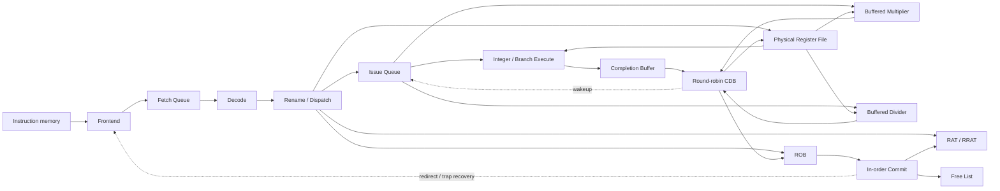

# RV32 OoO Core Design

本文说明当前 `rv32_ooo_core` 的实现边界、主要数据流、恢复规则和验证范围。当前版本是
single-dispatch、single-issue 的整数乱序核心：指令可以按照 operand readiness 乱序完成，
但必须按照 ROB 中的程序顺序退休。

## 1. 当前范围

已经接通的 core 路径包括：

- 单请求 instruction frontend、8-entry Fetch Queue 和静态 not-taken 预测；
- RV32I/RV32M Decode、immediate generation 和 MUL/DIV 功能单元分类；
- RAT/RRAT、64-entry PRF、Free List 和 16-entry ROB；
- 8-entry Issue Queue、整数 ALU 和 branch condition evaluation；
- ALU completion buffer、带缓冲的 MUL/DIV producer 和 round-robin CDB 仲裁；
- 统一 PRF writeback、ROB completion、依赖唤醒和顺序 Commit；
- Branch/JAL/JALR actual-next-PC 解析及退休时错误预测恢复；
- instruction access fault、illegal instruction、ECALL 和 EBREAK 的精确异常 metadata；
- trap 退休后的 sticky halt。

以下能力尚未接入 OoO core：

- load/store、data-memory interface、L1 instruction/data cache 和 memory ordering；
- OoO core 与 reference core 的 commit-level differential regression；
- superscalar Dispatch/Issue、advanced branch prediction、LSQ 和 L2 cache。

RV32M 分类、乘除法 producer 和共享 CDB 已经连接到 backend/core，并有独立单元测试和
core-level 定向程序。LSU 和 L1 cache 已用于其他 core，但尚未接入 `rv32_ooo_core`；
当前 core 的 instruction port 在集成测试中直连 memory model，data port 保持无效。

## 2. 数据流



Frontend 每次只保留一个 outstanding request，并把 `pc`、`instr`、
`predicted_next_pc` 和 instruction-access-fault 信息一起放入 Fetch Queue。当前预测器始终
选择 `PC+4`。

Rename/Dispatch 必须原子取得所需资源。ROB、Issue Queue 和 destination physical register
中的任何必要资源不可用时，该指令不能只更新其中一部分结构。

Issue Queue 根据 physical source readiness 和 functional-unit readiness 选择 entry。当前使用
最低槽位优先；它是确定性选择，不是严格 oldest-first age policy。

每周期最多发射一条指令，所以三个执行路径共享 PRF 的两个数据读端口。`fu_kind` 选择
ALU/branch、MUL 或 DIV；各自的 `issue_ready` 回到 `fu_ready`，一个繁忙的功能单元不会
阻止其他已就绪类型发射。Issue Stage 始终用选中 uop 的 source tag 驱动 PRF 地址，
MUL/DIV wrapper 直接读取同一组 `prf_rdata1/2`。

## 3. Rename 与物理寄存器

RAT 保存 speculative architectural-to-physical mapping，RRAT 保存已退休 mapping。写入非零
architectural register 的指令从 Free List 分配新 physical register，并把旧 mapping 保存到
ROB：

```text
Rename x5: old P5 -> new P32
ROB stores: rd=x5, new=P32, old=P5
Commit: RRAT[x5]=P32, release P5
```

PRF allocation 会清除目标 physical register 的 ready bit。Completion 根据 physical tag
写入 value 并置 ready；Issue Queue 同时通过 CDB tag 唤醒等待该结果的 consumer。

恢复时 RAT 和 Free List 从 committed checkpoint 恢复。产生恢复的指令本身仍在同一周期
完成 Commit，因此两个结构都显式包含该周期的退休更新。

## 4. ROB、Completion 与 Commit

ROB 按程序顺序分配，execution 按 generation-tagged ROB tag 完成。Generation bit 防止 slot
复用后接收旧 completion。只有 completed Head entry 能通过 ready/valid Commit interface
退休。

ROB entry 保存：

- PC、instruction 和 architectural/physical destination metadata；
- predicted next PC 和 control-flow kind；
- trap 标志及 trap cause；
- execution result 和 actual next PC；
- valid、completed 和 generation 状态。

三个 completion producer 使用相同的 ready/valid 协议与 `completion_payload_t`：

| Producer | 保存方式 | 接收新请求的条件 |
|---|---|---|
| ALU/branch | 单项 completion buffer，可同拍消费并替换 | buffer 空闲或本拍旧结果被接收 |
| MUL | 四项 outstanding credit 和四项 completion queue | 有剩余 credit 且底层 multiplier ready |
| DIV | 一份请求 metadata 和单项 completion 寄存器 | 没有在途请求、没有等待广播的结果且底层 divider ready |

MUL 在发射时预留 credit，避免底层无 ready 的 response 溢出队列。DIV 从接受请求起独占
wrapper，直到结果被 CDB 接收才允许下一条请求；两者都保留 ROB tag、physical destination、
write enable 和 `PC+4`，不会在结果返回时误用已经变化的 Issue 输入。

`rv32_cdb_arbiter` 每周期最多选中一个 producer，未选中的 producer 保持 valid 和完整
payload。当前 backend 把 CDB 下游 ready 固定为 1，PRF/ROB 每拍可接收一个广播；
producer 仍会因为仲裁竞争而受到背压。只有这个最终 CDB 驱动：

- PRF：`cdb_valid && cdb_rd_write` 写入 physical destination；
- Issue Queue：同样用寄存器写回有效条件唤醒匹配的 source tag；
- ROB：`cdb_valid` 按完整 ROB tag 标记完成，包括不写寄存器的 branch/trap uop。

完成顺序不必等于程序顺序；可见的 architectural Commit 仍由 ROB Head 决定。

## 5. Control-flow Recovery

Branch 使用 PRF 中的两个 source value 做 condition comparison；ALU 并行计算 target。
JAL/JALR 的 execution result 是 `PC+4`，actual next PC 是 target，JALR target 的 bit 0 被清零。

控制流指令完成时只把 actual next PC 写入 ROB，不立即改变 frontend。它到达 ROB Head 并
实际退休时才比较：

```text
actual_next_pc != predicted_next_pc
```

如果不同，该控制流指令本身正常 Commit，同时在同一个时钟沿：

- 清空 ROB 中全部年轻 entry；
- Flush Issue Queue、抑制 Issue Stage，并清除 ALU Completion Buffer；
- 丢弃 MUL 的在途 metadata、completion queue 和 outstanding credit；
- 复位底层 divider，清除 DIV 的在途请求和完成结果有效标志；
- 抑制共享 CDB 广播并复位仲裁优先级；
- RAT/Free List 恢复到 committed checkpoint；
- Flush Fetch Queue，并把 frontend PC 设置为 actual next PC；
- frontend epoch 翻转，使旧路径的迟到 I-cache response 无效。

把恢复放在退休点简化了 checkpoint 管理并保证精确状态，但会让错误路径存活更久，性能低于
execution-time recovery。这是当前正确性优先的设计选择。

不能仅靠 ROB 拒绝 stale tag 来代替功能单元取消：PRF 写回根据 physical destination，
不会再验证 ROB tag。恢复必须同时阻止旧执行结果重新进入共享 CDB，避免污染复用后的寄存器。

## 6. Precise Traps

Decode 按以下优先级生成同步异常：

1. instruction access fault；
2. illegal instruction；
3. ECALL；
4. EBREAK。

Trap instruction 不读取或写入 architectural register，也不分配 physical destination。它作为
无副作用的 pseudo-ALU uop 通过现有 completion path，把 trap metadata 保存在 ROB 中。

只有 trap entry 到达 ROB Head 才产生 `commit_trap`。该 entry 自身产生一条 Commit record，
年轻状态同时被清除，core 随后进入 sticky halt。Sticky halt 只由 reset 清除，并阻止新的
instruction request、Fetch Queue enqueue 和 Decode handshake。

当前项目没有 privileged trap handler，因此使用 halt-after-trap，而不是跳转到 `mtvec`。

## 7. Verification Boundary

`tb/core/rv32_ooo_integer_tb.sv` 验证 Rename-to-Commit 后端，包括 dependent wakeup、年轻指令
先完成、顺序退休和 Commit backpressure。

`tb/core/rv32_ooo_core_tb.sv` 使用真实取指和 Decode 路径验证：

- LUI、AUIPC、OP-IMM 和 OP 的顺序 Commit；
- producer/consumer dependency；
- taken BEQ recovery 和 sequential wrong-path suppression；
- ECALL precise Commit、trap cause、年轻状态清除和 sticky halt。

Fetch Queue、frontend epoch、decoder、branch unit、ROB、rename structures 和 Issue Queue 另有
独立 regression。CDB arbiter regression 验证 single-winner backpressure 和 round-robin 公平性；
OoO multiplier regression 验证固定延迟 metadata 对齐、连续四请求、completion backpressure
和 recovery Flush。OoO divider regression 验证单条 DIV 的完整 payload、三拍背压保持、
计算中取消和已完成结果清除，以及 Flush 后重新接收请求。

`tb/core/rv32_ooo_rv32m_tb.sv` 使用同一个 core 和独立于 RTL 的短程序期望值，覆盖：

| Task | Commit 检查 | 并行微架构检查 |
|---|---|---|
| `test_mul_dependency` | MUL 和 dependent ADD 的顺序结果 | 通过消费者结果验证 wakeup/PRF 数据路径 |
| `test_div_out_of_order_completion` | DIV、独立 ADDI、dependent ADD 依序退休 | 独立 ADDI 先于 DIV 在 CDB 广播 |
| `test_completion_contention` | 八条写寄存器指令及 ECALL | ALU/MUL 同时有效、单 winner、受阻完整 payload 保持、八次寄存器写回 |
| `test_wrong_path_div_flush` | 跳过错误路径，正确路径 DIV/ADD 正常退休 | 错误 DIV 握手启动、redirect 时仍 active、恢复后无旧 ROB tag 广播、新 DIV 能重新启动 |

Core-level 程序当前使用 MUL 和 DIV，不是八条 RV32M 指令逐一运行的集成测试。
Decoder 单元测试覆盖八条指令；Rename/Dispatch 单元测试直接检查 MUL、DIV 两个代表的
分类和字段传递。独立 multiplier/divider 测试覆盖算术变体、除零和 signed overflow。
这里也没有穷举所有控制流和 trap encoding，
尚不构成完整 ISA compliance 或 OoO/reference 差分验证。

单独运行这组 core-level 测试：

```bash
make CAD_ENV=/path/to/env.sh test-ooo-rv32m
```

`compile-ooo-rv32m` 只构建仿真程序；`test-ooo-rv32m` 会执行它，并且已包含在
默认 `make test` 中。工具已在 PATH 中时可以省略 `CAD_ENV`。

## 8. Next Integration Stages

1. O6：先实现 ROB-Head-only memory execution，再连接现有 L1 cache；
2. O7：让 OoO core 与 reference core 使用独立 memory image，按 Commit 顺序差分；
3. 在稳定 baseline 上研究 early load、LSQ 和 store-to-load forwarding。
