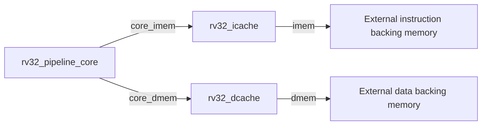

# RV32 L1 Cache 开发教程

本文档是一份完整的 L1 cache 开发教程，依次说明公共 geometry、blocking I-cache、write-back D-cache，以及把两者接入五级流水线的方法。第一版采用 direct-mapped、32-byte line 和 blocking miss；2-way associativity、64-byte line 和 unified L2 属于后续结构扩展。

## 1. 开发目标和边界

最终 L1 目标配置为：

| 项目 | L1 I-cache | L1 D-cache |
|---|---:|---:|
| 容量 | 32 KiB | 32 KiB |
| 最终 associativity | 2-way | 2-way |
| 最终 line size | 64 byte | 64 byte |
| 写策略 | 只读 | Write-back、write-allocate |
| 第一版 miss handling | Blocking | Blocking |

Direct-mapped baseline 的 I-cache 和 D-cache 都使用32 KiB 容量和32-byte line。它们是后续 PPA、miss rate 和 associativity 实验的基线，不是临时代码；容量与 line size 均通过 parameter 表达。

当前第一版暂不包含：

- 多个同时在途的 miss；
- MSHR；
- prefetcher；
- coherence；
- virtual address translation；
- ECC；
- 真实 SRAM macro 实例。

## 2. Cache 在现有系统中的位置

加入 I-cache 前：

```text
Pipeline instruction port → rv32_simple_memory
```

加入后：

```text
Pipeline instruction port → rv32_icache → backing memory
```

CPU 侧继续使用原来的单请求 blocking protocol。Pipeline 不知道一次 response 来自 cache hit 还是 refill，只会在没有 response 时等待。

I-cache CPU 侧信号：

| 信号 | 方向 | 含义 |
|---|---|---|
| `cpu_req_valid_i` | CPU → Cache | CPU 提供一个取指地址 |
| `cpu_req_ready_o` | Cache → CPU | Cache 本周期能够接受请求 |
| `cpu_req_addr_i` | CPU → Cache | 32-bit byte address |
| `cpu_resp_valid_o` | Cache → CPU | 取指结果在本周期有效 |
| `cpu_resp_data_o` | Cache → CPU | 返回的32-bit instruction |
| `cpu_resp_error_o` | Cache → CPU | 下级访问发生 access fault |

Memory 侧同样采用 request/response handshake，但每次只读一个32-bit word。32-byte line miss 因此需要8次下级读取。

## 3. 第一版 Cache Geometry

默认参数：

```text
ADDR_WIDTH  = 32
CACHE_BYTES = 32 × 1024 = 32768
LINE_BYTES  = 32
WORD_BYTES  = 4
```

由此得到：

```text
WORDS_PER_LINE = LINE_BYTES / WORD_BYTES = 8
SET_COUNT      = CACHE_BYTES / LINE_BYTES = 1024
OFFSET_BITS    = log2(LINE_BYTES) = 5
INDEX_BITS     = log2(SET_COUNT) = 10
WORD_INDEX_BITS= log2(WORDS_PER_LINE) = 3
TAG_BITS       = 32 - INDEX_BITS - OFFSET_BITS = 17
```

Direct-mapped 每个 set 只有一条 line，因此 line count 与 set count 相同。地址拆分为：

```text
31                    15 14             5 4              0
+-----------------------+----------------+----------------+
|       Tag[16:0]       |  Index[9:0]    |  Offset[4:0]   |
+-----------------------+----------------+----------------+
```

Offset 内部继续解释为：

```text
address[4:2]：32-byte line 中的第几个32-bit word
address[1:0]：word 中的 byte offset，正常取指必须为 2'b00
```

不要在 RTL 中直接写死 `[14:5]` 和 `[31:15]`。固定切片便于第一眼理解，但之后把 line size 改成64 byte 时会失效。RTL 应由 `$clog2` localparam 推导位宽。

## 4. C1：地址分解

实现时先完成地址分解并通过对应测试，再加入数组、hit path 和状态机。这样可以独立验证纯地址函数，避免把 geometry 错误与控制逻辑错误混在一起。

需要驱动五个内部信号：

```systemverilog
cpu_req_offset
cpu_req_index
cpu_req_word_index
cpu_req_tag
cpu_req_line_base
```

推荐使用 continuous assignment。伪代码关系如下：

```text
offset    = address最低OFFSET_BITS
index     = 从OFFSET_BITS开始的INDEX_BITS
wordIndex = 从bit 2开始的WORD_INDEX_BITS
tag       = address最高TAG_BITS
lineBase  = address低OFFSET_BITS清零
```

SystemVerilog 的 indexed part-select 可以避免写死位置：

```systemverilog
vector[base +: width]  // 从base向高位选择width位
vector[base -: width]  // 从base向低位选择width位
```

因此实现时可以从以下表达式推导，而不是照抄固定 bit number：

```text
address[OFFSET_BITS +: INDEX_BITS]
address[ADDR_WIDTH-1 -: TAG_BITS]
address[2 +: WORD_INDEX_BITS]
```

Line base 的定义是包含该地址的 cache line 首地址。例如：

```text
address   = 0x0000104c
line base = 0x00001040
```

因为32-byte line 的起始地址必须是32的整数倍，低5 bit全部清零。

## 5. T1：地址分解 Testbench

`tb/cache/rv32_icache_tb.sv` 中的 `check_address_fields()` 接收地址和五个期望值。第一版允许通过 `dut.cpu_req_*` 层次化引用检查内部组合信号；完成 cache 外部行为后，主要测试应只观察端口。

Task 应完成：

```text
cpu_req_addr = address
等待一个很短的组合稳定时间
逐个使用 !== 比较内部字段
错误时输出原地址、字段名、expected和actual
```

建议 directed cases：

| Address | Tag | Index | Offset | Word index | Line base |
|---:|---:|---:|---:|---:|---:|
| `0x00000000` | `0x00000` | `0x000` | `0x00` | `0` | `0x00000000` |
| `0x0000104c` | `0x00000` | `0x082` | `0x0c` | `3` | `0x00001040` |
| `0x0000904c` | `0x00001` | `0x082` | `0x0c` | `3` | `0x00009040` |
| `0x00007ffc` | `0x00000` | `0x3ff` | `0x1c` | `7` | `0x00007fe0` |

`0x104c` 和 `0x904c` 刻意具有相同 Index、Offset 和 Word index，但 Tag 不同。Conflict replacement 测试复用这对地址。

在只验证 C1/T1 时，可以先调用这四个 case；随后保留它们作为永久 geometry regression，再继续添加外部端口行为测试。

## 6. C2：数组和 Hit Path

Direct-mapped I-cache 需要三组存储：

```text
valid_array[SET_COUNT]
tag_array[SET_COUNT][TAG_BITS]
data_array[SET_COUNT][LINE_BITS]
```

默认容量下：

```text
valid：1024 bit
tag：  1024 × 17 bit
data： 1024 × 256 bit = 32 KiB
```

一次 lookup：

```text
使用index读取valid、stored tag和line data
                 ↓
hit = valid && stored_tag == request_tag
                 ↓
使用word index从line中选择32-bit instruction
```

不要使用八层 case 手工选择 word。可以用 variable indexed part-select，起始位置为 `word_index * 32`。

功能模型可以先使用 SystemVerilog unpacked array。最终 OpenROAD PPA 评估时，data array 应替换或映射到 SRAM macro；32 KiB data array 如果全部综合为 flip-flop，面积和功耗没有代表性。

## 7. C3：Blocking Miss Refill

Miss 时必须保存原请求信息，因为 CPU 地址可能在后续周期改变。至少需要：

```text
request address/tag/index/word index
refill line base
refill word counter
refill buffer
refill error flag
current state
```

状态流：

```text
IDLE
  ↓ 接受CPU请求
LOOKUP
  ├─ hit  → RESPONSE
  └─ miss → REFILL_REQUEST
                 ↓ request handshake
             REFILL_WAIT
                 ↓ response
       counter不是最后一个 → REFILL_REQUEST
       counter是最后一个   → 写array → RESPONSE
```

Lower request address 为：

```text
saved_line_base + refill_word_count * 4
```

`mem_req_valid_o && !mem_req_ready_i` 时，request address 和 valid 必须保持不变。每个 accepted request 只能对应一个 response，不能在等待 response 时重复发送同一个 word。

## 8. C4：Reset、Backpressure 和 Error

Reset 必须让所有 valid bit 变为0。Data 和 tag 不需要全部清零，因为 valid=0 时它们不会形成 hit。这样更接近真实 SRAM 使用方式，也减少无意义 reset logic。

如果任意 refill word 返回 `mem_resp_error_i=1`：

1. 记录该 miss 失败；
2. 不把失败 line 标为 valid；
3. 向 CPU 返回一次 `cpu_resp_valid_o=1` 和 `cpu_resp_error_o=1`；
4. 返回 IDLE，允许后续请求继续执行。

本实现采用第一个 error 后立即终止当前 refill：旧 line 不被破坏，失败 line 不会变为 valid，CPU 收到一次 error response。这样不会在已经确定失败后继续产生无用的下级访问。

## 9. C5：Pipeline Integration 和 Differential Checking

I-cache integration 最初验证了 pipeline instruction port、I-cache CPU side 和 backing instruction-memory port 的连接。这一连接保留在后续的 `rtl/core/rv32_pipeline_l1_top.sv` 中；加入 D-cache 前，data-memory port 暂时直接穿过 wrapper。

集成验证包括：

- 全部 pipeline directed regression；
- reference-vs-pipeline commit differential test；
- 带 cold miss 的有限总周期 timeout；
- 同一 cache line 内连续取指只产生一次8-word refill；
- 跨 line 的 JAL redirect 产生第二次 refill，且错误路径指令不提交；
- 下级 instruction request 计数。

Commit trace 必须保持完全一致。允许变化的是 cycle count 和 backing-memory request 数量。

当前 baseline 不在可综合 I-cache 中加入硬件性能计数器，以免影响 PPA。Testbench 统计 accepted backing-memory requests。需要进行性能研究时，可以增加以下可关闭计数器：

```text
access_count
hit_count
miss_count
refill_word_count
stall_cycle_count
```

永久关系：

```text
access_count = hit_count + miss_count
```

## 10. D-cache 为什么比 I-cache 复杂

I-cache 只接收 read request。命中时返回 instruction，未命中时读取完整 line。D-cache 还要处理 store，因此同一条 line 除了 `valid`、`tag` 和 `data`，还需要 `dirty` 状态。

| 情况 | I-cache | D-cache |
|---|---|---|
| Hit | 返回 instruction | Load 返回 word；store 修改被 mask 选中的 byte |
| Miss | Refill 新 line | 可能先 write back dirty victim，再 refill |
| Lower write | 无 | Dirty eviction 写回完整 line |
| Store miss | 无 | Write-allocate：先 refill，再 merge store |
| Error | Refill access fault | Writeback 和 refill error 都要保持旧 line 可恢复 |

第一版仍然是 blocking cache：一次只保存一个 CPU request，下级最多有一个 transaction 在途。因此不需要 MSHR、load/store queue 或多个 miss 合并。

## 11. D-cache 与 LSU 的职责边界

`rtl/backend/rv32_lsu.sv` 负责解释 RISC-V load/store 指令：检查 alignment，把 byte address 对齐到32-bit word，生成 store byte mask，并对 load 结果做 byte/halfword 选择和符号扩展。D-cache 不重复解释 LB、LH、LW、SB、SH、SW；它只处理 LSU 已经格式化好的32-bit transaction。

例如 `SB x5, 1(x6)` 的有效地址是 `0x00001041`，并且 `x5[7:0] = 0xaa`，LSU 应向 D-cache 提供：

```text
addr  = 0x00001040
wdata = 0x0000aa00
wstrb = 0010
write = 1
```

D-cache 只看到 `wstrb[1]` 为1，因此用 `wdata[15:8]` 替换 cached word 的第二个 byte。它不需要知道原指令是 SB。

D-cache CPU side 与 pipeline data-memory port 对应：

| Signal | 含义 |
|---|---|
| `cpu_req_valid_i` / `cpu_req_ready_o` | CPU request handshake |
| `cpu_req_addr_i` | 对齐后的32-bit byte address |
| `cpu_req_write_i` | 0 为 load，1 为 store |
| `cpu_req_wdata_i` | 已移动到目标 byte lane 的 store data |
| `cpu_req_wstrb_i` | 四个 byte lane 的写使能 |
| `cpu_resp_valid_o` | 当前 request 完成 |
| `cpu_resp_rdata_o` | Load 返回的完整32-bit word |
| `cpu_resp_error_o` | 下级访问失败 |

Lower-memory side 仍然一次传输一个32-bit word：

```text
Refill read   : mem_req_write_o=0, mem_req_wstrb_o=0000
Victim write : mem_req_write_o=1, mem_req_wstrb_o=1111
```

每个 accepted lower request 都必须等到一次 `mem_resp_valid_i`，才能开始下一个 word。

## 12. D1/D2：地址、数组和 Hit Path

D-cache 与 I-cache 使用相同的 parameter geometry 和地址分解方法。不要复制一套写死的 bit number；`cpu_req_offset`、`cpu_req_index`、`cpu_req_word_index`、`cpu_req_tag` 和 `cpu_req_line_base` 的关系与第4节完全相同。

Direct-mapped D-cache 需要四组 array：

```text
valid_array[SET_COUNT]
dirty_array[SET_COUNT]
tag_array[SET_COUNT][TAG_BITS]
data_array[SET_COUNT][LINE_BITS]
```

Request handshake 后必须保存 `addr`、`write`、`wdata` 和 `wstrb`。CPU 在 request 被接受后可以改变输入，所以 LOOKUP 及后续状态只能使用保存的 request。

Load hit 的关系是：

```text
hit = valid_array[index] && tag_array[index] == request_tag
response word = data_array[index][word_index * 32 +: 32]
```

Store hit 不能直接用 `wdata` 覆盖整个 word。需要逐 byte merge：

```text
new_word = old_word
for lane = 0..3:
    if saved_wstrb[lane] == 1:
        new_word[lane*8 +: 8] = saved_wdata[lane*8 +: 8]
```

然后把 `new_word` 放回 line 中原 word 的位置并设置 `dirty_array[index] = 1`。Store hit 不访问 lower memory，但仍必须返回一次 successful CPU response，否则 pipeline 会永久等待。

## 13. D3：Clean Miss、Refill 和 Write-allocate

发生 miss 后先检查当前 set 中的 victim：

| Victim 状态 | 下一步 |
|---|---|
| Invalid | 直接 refill |
| Valid、clean、tag 不同 | 直接 refill |
| Valid、dirty、tag 不同 | 先 writeback，再 refill |

Clean load miss 的执行顺序：

```text
保存 CPU load request
        ↓
LOOKUP 发现 miss，victim 不需要 writeback
        ↓
依次读取 line base + 0、4、...、28
        ↓
在 refill buffer 中收齐8个 word
        ↓
一次性安装 data、tag、valid，并令 dirty=0
        ↓
返回 request word
```

不要在每个 refill response 到达时直接公开半条新 line。先写 `refill_buffer_q`，最后再原子安装，error 时就能保留旧 array entry。

Store miss 采用 write-allocate：先 refill 完整 line，再把保存的 store mask/data merge 到目标 word，安装时将 dirty 设为1。不能只把 store 的一个 word 放入空 line，因为同一 line 的另外七个 word 仍属于 lower memory，以后也可能被 load。

## 14. D4：Dirty Victim Writeback

Tag mismatch 时同时存在新 request 和旧 victim。必须保存旧 line 的 tag 与 data，例如：

```text
victim_tag_q
victim_line_q
```

Victim line base 由旧 tag 和发生冲突的 set index 重建：

```text
victim_line_base = {victim_tag_q, request_index, OFFSET_BITS 个 0}
```

不能使用新 request 的 line base，否则会把旧数据写入新地址，形成难以察觉的 memory corruption。

完整状态流建议为：

```text
IDLE
  ↓ 保存 CPU request
LOOKUP
  ├─ hit → RESPONSE
  ├─ clean miss → REFILL_REQUEST
  └─ dirty miss → WRITEBACK_REQUEST
                         ↓ request accepted
                    WRITEBACK_WAIT
                         ↓ response
                    下一 word 或 REFILL_REQUEST
REFILL_REQUEST
  ↓ request accepted
REFILL_WAIT
  ↓ response
下一 word 或 REFILL_INSTALL
  ↓
RESPONSE
```

每个 victim word 都使用 full-word write：

```text
addr  = victim_line_base + transfer_count * 4
wdata = victim_line_q[transfer_count * 32 +: 32]
wstrb = 1111
write = 1
```

即使最初只执行了 SB，cache line 中也保存了 merge 后的完整 word，所以 eviction 可以按完整 word 写回。

Backpressure 的规则是：当 `mem_req_valid_o=1 && mem_req_ready_i=0` 时，address、write、wdata、wstrb 和 transfer counter 必须保持不变。只有 request handshake 后才能进入 WAIT，只有 response 后才能处理下一个 word。

Error policy：

- Writeback error：停止当前 miss，不启动 refill，保留旧 valid/dirty line，并向 CPU 返回 error；
- Refill error：不安装部分 line，保留原 array entry，并向 CPU 返回 error；
- 全部 refill 成功：最后一次性替换旧 entry。

实现控制器时通常需要以下跨周期寄存器：

```text
state_q
request_addr_q
request_write_q
request_wdata_q
request_wstrb_q
response_rdata_q
response_error_q
transfer_count_q
refill_buffer_q
victim_tag_q
victim_line_q
```

可以从 `request_addr_q` 重新计算的 index、tag、word index 和 line base 不必重复保存。

## 15. Standalone D-cache 验证

`tb/cache/rv32_dcache_tb.sv` 按以下功能组验证 D-cache：

1. Parameter geometry 和地址分解；
2. Hit lookup、byte merge 和 dirty 状态；
3. CPU request/response 与 hit 不访问下级 memory；
4. Clean load miss、clean replacement 和 store write-allocate；
5. Dirty victim 的8次 writeback 与随后8次 refill；
6. Lower request backpressure 下的信号稳定性；
7. Writeback/refill error 后的 array 状态与恢复能力。

Testbench 统计 accepted transaction：

```text
accepted = mem_req_valid_o && mem_req_ready_i
```

不能用 `mem_req_valid_o` 为高的周期数代替 transaction 数，因为 backpressure 可能让同一 request 保持多个周期。部分后续 task 会使用前一 task 建立的 dirty line；若改变调用顺序，应先确认该 task 是否依赖已有 cache state。

Standalone D-cache 的完成标准：

- Cold load/store miss 各产生恰好8个 refill read；
- Store miss 先 refill，再 merge，并置 dirty；
- SB、SH、SW 只修改 mask 选择的 byte；
- Dirty conflict 先8次 writeback，再8次 refill；
- Victim address 使用旧 tag 重建；
- Backpressure 下没有重复 transaction；
- Writeback/refill error 不会安装部分 line 或丢失旧 dirty line；
- Reset 后旧 line 不再命中。

## 16. D5：将两个 L1 接入同一个 Pipeline Wrapper

不需要复制一个新的 CPU core。`rv32_pipeline_core.sv` 保持为纯 pipeline，实现外部 instruction/data memory protocol；原 I-cache integration wrapper 演进并重命名为 `rtl/core/rv32_pipeline_l1_top.sv`，在同一层连接两个 cache：



这个 wrapper 不是另一个 CPU：它没有 decoder、register file 或 pipeline state，只负责层次连接和 cache parameter。保留 wrapper 可以让 `rv32_pipeline_core` 单独测试，也能在未来替换 cache 层次而不修改 core 内部逻辑。

在 unified L2 出现前，I-cache 和 D-cache 使用两组独立 backing ports，因此此阶段不需要仲裁器。

### D5A：声明 core-to-D-cache wires

文件：`rtl/core/rv32_pipeline_l1_top.sv`，位置：现有 `core_imem_*` 声明之后。

声明下面九个信号，宽度与 wrapper 的 external dmem ports 一致：

```text
core_dmem_req_valid
core_dmem_req_ready
core_dmem_req_addr[31:0]
core_dmem_req_write
core_dmem_req_wdata[31:0]
core_dmem_req_wstrb[3:0]
core_dmem_resp_valid
core_dmem_resp_rdata[31:0]
core_dmem_resp_error
```

这些信号只是 pipeline core 和 D-cache CPU side 之间的内部连线，不是 backing-memory request。

### D5B：修改 pipeline core 的 data-port 连接

文件：`rtl/core/rv32_pipeline_l1_top.sv`，位置：`rv32_pipeline_core core (...)` 实例。

保持 instruction port、commit port 和所有 parameter 不变，只把九个 `.dmem_*` 端口从 wrapper external dmem 信号换成对应的 `core_dmem_*`。完成后，pipeline 不再直接访问 backing data memory。

### D5C：实例化 D-cache

文件：`rtl/core/rv32_pipeline_l1_top.sv`，位置：`rv32_icache` 实例之后。

实例化 `rv32_dcache`：

- `ADDR_WIDTH` 使用32；
- `CACHE_BYTES` 使用 `DCACHE_BYTES`；
- `LINE_BYTES` 使用 `DCACHE_LINE_BYTES`；
- CPU side 连接九个 `core_dmem_*`；
- Memory side 连接 wrapper 的 external `dmem_*`。

完成 D5C 后，external dmem port 的含义从“pipeline 的单个 load/store transaction”变为“D-cache 发出的 refill read 或 victim writeback transaction”。

### D5T1：Load miss 和 hit

文件：`tb/cache/rv32_pipeline_l1_tb.sv`，task：`test_dcache_load_miss_and_hit`。

加载一段包含两次同 line load 的程序。第一次 load 应提交正确 rd value，并使 `backing_dmem_read_count` 增加8；第二次 load 应从 cache hit，提交值相同，但 read count 不再增加。检查的是 backing port 的 handshake 数，不是等待周期数。

### D5T2：Store merge 与 commit

文件：`tb/cache/rv32_pipeline_l1_tb.sv`，task：`test_dcache_store_merge`。

分别执行 SB、SH 和 SW，并检查退休时的 `commit_mem_addr`、`commit_mem_wmask` 与 `commit_mem_wdata`。每个 store 后执行 load，验证 pipeline 从 D-cache 观察到 merge 后的值。

Write-back cache 的 store hit 只更新 cache array，不会立即更新 `memory_model`。因此此测试不能在 store commit 后直接读取 backing memory 来判断 store 是否正确。

### D5T3：Dirty eviction

文件：`tb/cache/rv32_pipeline_l1_tb.sv`，task：`test_dcache_dirty_eviction`。

先 store 使一条 line dirty，再访问 tag 不同但 index 相同的地址。期望顺序是8次 backing write，然后8次 backing read。只有 writeback 完成后，才能检查 `memory_model` 中的旧 line 已包含修改后的 byte。

### D5T4：Data access fault

文件：`tb/cache/rv32_pipeline_l1_tb.sv`，task：`test_dcache_access_errors`。

分别注入 refill read error 和 dirty writeback error。Pipeline 必须只为原始 memory instruction 产生一次 precise access-fault commit；writeback 失败时不能继续发 refill request。Pipeline 在 trap 后进入 sticky halt，因此 cache 的错误恢复和旧 dirty victim 保留行为由 standalone D-cache regression 单独检查。

完成每个 task 后再把它加入 testbench 的 `initial` 调用序列。不要一次启用四个空 task，否则失败时难以判断是哪条路径出错。

## 17. Reset、存储实现与 PPA

Reset 只需要清除 valid bit；D-cache 建议同时清除 dirty bit。Tag/data 不需要 reset，因为 valid=0 时它们不能形成 hit。不要给32 KiB data array 添加同步或异步 reset，否则通常会破坏 SRAM inference，并生成巨大的 reset mux/flip-flop 网络。

固定上界的 `for` loop、常量乘4或 variable part-select 不等于 RTL 中一定存在通用乘法器。综合器通常会展开循环并把乘2的幂转成移位/接线。真正需要关注的 PPA 路径是 tag compare、line word selection、store byte merge、状态控制和 data array 的实现方式。

当前 SystemVerilog array 适合功能仿真。进行有意义的 OpenROAD cache PPA 前，应把 data array 映射到目标工艺的 SRAM macro；若32 KiB 全部展开成 flip-flop，面积、功耗和频率不代表工业 cache。

## 18. 构建命令与完整 L1 完成标准

Standalone cache：

```bash
make CAD_ENV=/path/to/env.sh compile-icache
make CAD_ENV=/path/to/env.sh test-icache
make CAD_ENV=/path/to/env.sh compile-dcache
make CAD_ENV=/path/to/env.sh test-dcache
```

Pipeline + separate L1 wrapper：

```bash
make CAD_ENV=/path/to/env.sh compile-pipeline-l1
make CAD_ENV=/path/to/env.sh test-pipeline-l1
```

`test-pipeline-l1` 按顺序运行 I-cache same-line/redirect 场景和 D-cache load、store merge、dirty eviction、access-error 场景。完整 L1 baseline 满足：

- I-cache cold miss、same-line hit、conflict replacement、redirect 和 error 测试通过；
- D-cache load/store hit、write-allocate、dirty eviction、backpressure 和 error 测试通过；
- Pipeline 的 instruction/data ports 都只连接各自 L1 的 CPU side；
- Architectural commit 内容和顺序不因 cache latency 改变；
- 原 pipeline regression 与 core differential regression 继续通过；
- `make test` 全部通过。

后续扩展顺序为 cache flush/invalidate、32/64-byte line 对比、2-way associativity，然后再设计 I/D cache 到 unified L2 的仲裁与 line-level protocol。
